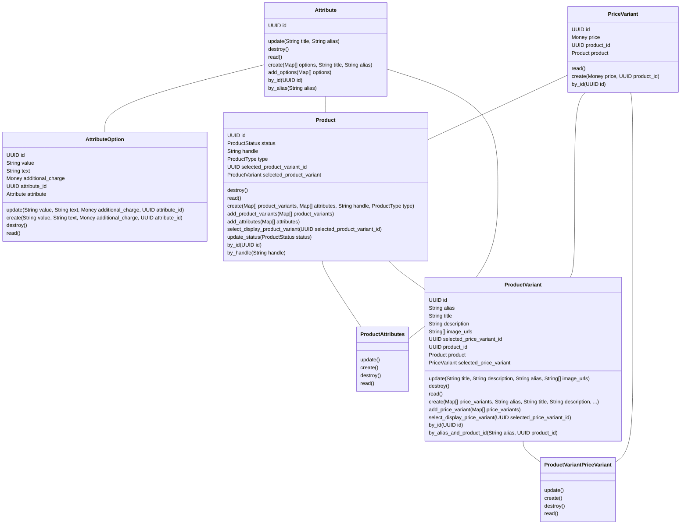
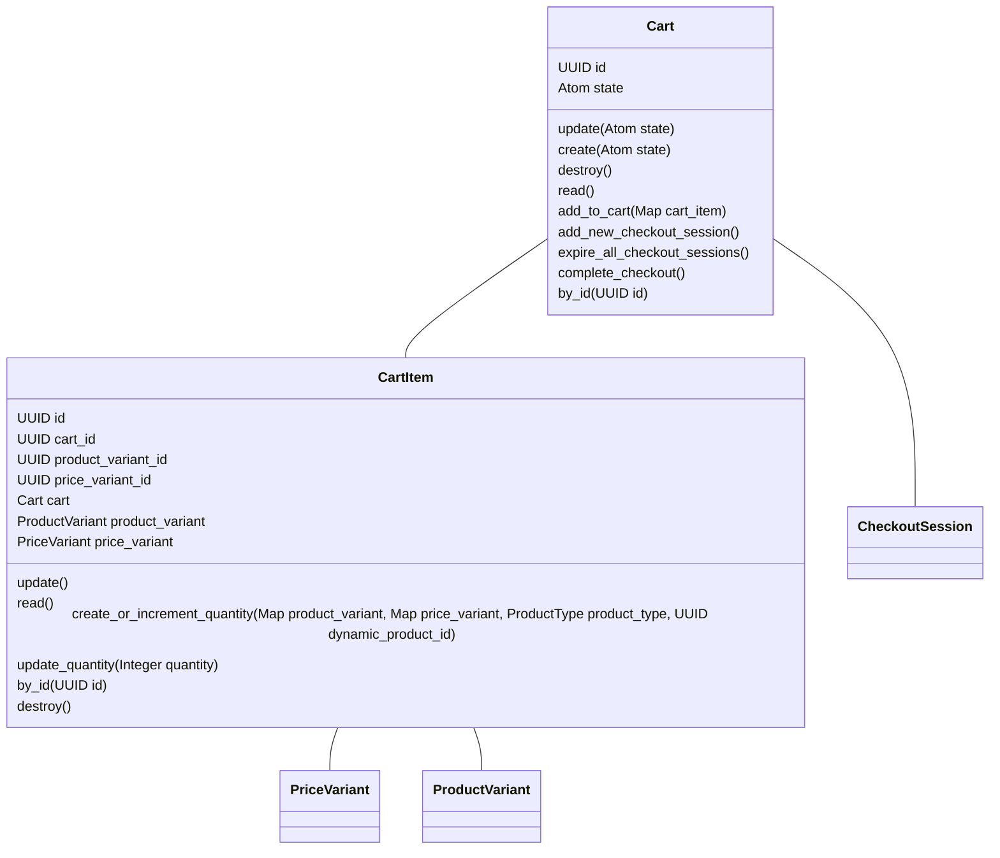
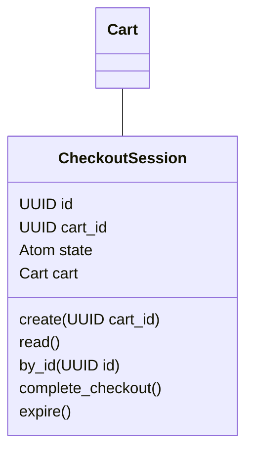

# Shopifex

Shopifex is an example [Fireside](https://github.com/ibarakaiev/fireside)
component that implements e-commerce functionality. To install
it, make sure to add `:fireside` to your list of dependencies and run:

```
mix fireside.install shopifex@github:ibarakaiev/shopifex
```

## Admin panel

Shopifex enables `ash_admin`. If you use `Phoenix`, follow the
[`AshAdmin`](https://hexdocs.pm/ash_admin/getting-started-with-ash-admin.html)
tutorial to enable the admin routes in your app.

## Resources

### Products

`Product`s may have multiple `Attribute`s which may have several
`AttributeOption`s. Example: shoes may have two attributes, size and color,
which have many attribute options (size options and different colors).
Attribute options may also introduce an additional charge.

Additionally, each `Product` needs at least one `ProductVariant` which defines
a title, description, handle (displayed in the URL), etc. Each `ProductVariant`
in turn needs at least one `PriceVariant`, which defines a price. A
`PriceVariant` may belong to multiple `ProductVariants`, but not to multiple
products, and a `Product` may not have multiple identical `Price`s.

This architecture allows testing different titles and descriptions, as well
as different prices (independent of titles and descriptions).

`Product` has a `display_product_variant` function, which works as follows:
- if `product_variant_id` is passed, that product variant will be loaded.
- otherwise:
  - if `selected_product_variant_id` is set, that product variant will be used.
  - otherwise, the oldest existing product variant will be loaded.

`ProductVariant` has a similar `display_price_variant` function. Additionally,
it has a `compare_at_price` function, which returns the most expensive price
variant. This is useful when a discount is available, and the highest price
can be shown as the "original" price.

Additionally, `Product` has helper methods to retrieve the `title`,
`description`, and `price`, which all rely on the `display_product_variant`
(and have the same function signature).

A product can also be `:static` or `:dynamic`. If a product is `:dynamic`,
an entire new Ash resource may be used to implement it for complex use cases
such as [Memory Trivias by Memory+](https://memory.plus/products/memory-trivia)
which use Shopifex.



### Carts

A `Cart` contains multiple `CartItem`s which record what `ProductVariant` and
`PriceVariant` was used (and a `dynamic_product_id` if the product is dynamic).

Cart items are added with `Cart.add_cart_item`. If a cart item is already in
the cart, its quantity will be increased. An individual cart item's quantity
can be changed with `CartItem.update_quantity`.

`CartItem` implements several helper methods:
- `subtotal`: the price of a cart item (price of a product with all additional
  charges times the quantity).
- `compare_at_subtotal`: what the subtotal would have been if the compare-at
  price was used
- `display_title`: what title to display in the cart. If a cart
  item is associated with a dynamic product, a dynamic title will be used.
- `display_description`: same as above, but for description.

A `Cart` also has associated `CheckoutSession`s. It has two functions to aid
with creating and maintaining checkout sessions: 
- `add_new_checkout_session`: adds a new CheckoutSession and invalidates all
  previous ones.
- `expire_all_checkout_sessions`: invalidates all existing associated
  checkout sessions.

All changes are broadcasted to PubSub so that the cart stays as up-to-date as
possible if LiveView is used.


### Checkout
Shopifex doesn't implement checkout session functionality, but exposes a
`CheckoutSession` resource to make it easier to track active checkout sessions
and invalidate inactive ones if the cart's contents change. It is up to the end
user to implement checkout functionality, either via Stripe Checkout Sessions
or something else. For example, you may add a `StripeCheckoutSession`
(in a new `Stripe` Ash domain) that `belongs_to` a `CheckoutSession`.



### Orders
Shopifex doesn't make assumptions about how orders are placed, tracked, and
fulfilled. It is recommended to create a new `Orders` domain which will contain
orders created from successful checkout sessions.
