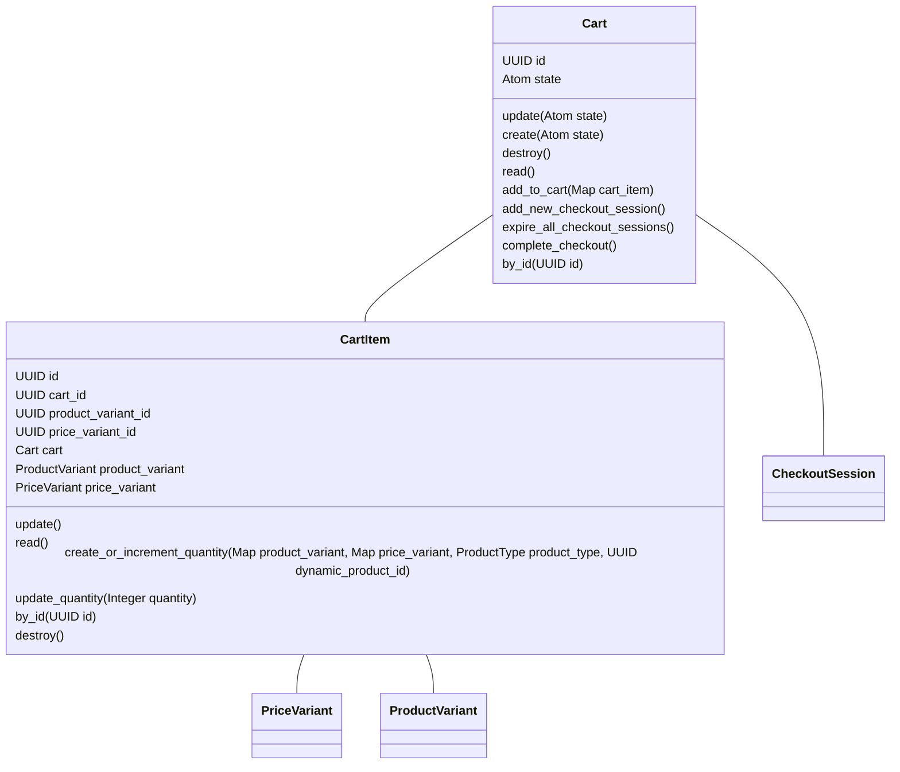
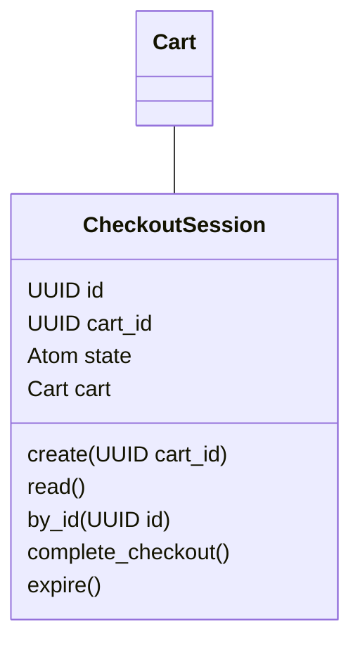

# Shopifex

Shopifex is an example [Fireside](https://github.com/ibarakaiev/fireside)
component that implements e-commerce functionality. To install
it, make sure to add `:fireside` to your list of dependencies and run:

```
mix fireside.install shopifex@github:ibarakaiev/shopifex
```

## Resources

### Products


### Carts


### Checkout

